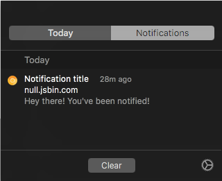

# NotificationClear

 

# Information:

- Designed for 10.9+ 
- SIMBL plugin to add "Clear All" button to Notification Center on OS X
- Author: [w0lfschild](https://github.com/w0lfschild)

# Note:

-

# Installation:

1. Download [mySIMBL](https://github.com/w0lfschild/app_updates/raw/master/mySIMBL/mySIMBL_0.2.5.zip)
2. Download [NotificationClear](https://github.com/w0lfschild/NotificationClear/raw/master/build/NotificationClear.zip)
3. Unzip downloads
4. Open `NotificationClear.bundle` with `mySIMBL.app`
5. In mySIMBL preferences click "Inject into running applications"

### License:
Pretty much the BSD license, just don't repackage it and call it your own please!    
Also if you do make some changes, feel free to make a pull request and help make things more awesome!